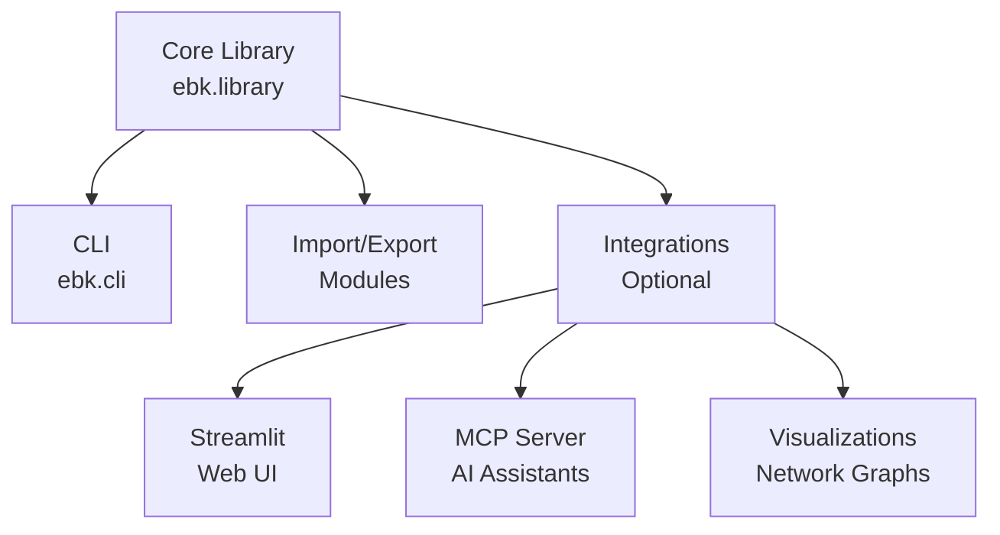

# ebk - eBook Library Manager

Welcome to the ebk documentation! ebk is a lightweight and versatile tool for managing eBook metadata with a comprehensive fluent API and rich CLI.

## Key Features

- 📚 **Fluent Python API** - Comprehensive programmatic interface with method chaining
- 🎨 **Rich CLI** - Beautiful terminal interface powered by Typer and Rich
- 📥 **Multiple Import Sources** - Calibre, raw ebooks, ZIP archives
- 🔍 **Advanced Search** - Regex, JMESPath, and fluent query builders
- 📤 **Flexible Export** - Hugo sites, ZIP archives, symlink DAGs
- 🤖 **Smart Recommendations** - Find similar books based on metadata
- 🔗 **Optional Integrations** - Web UI, AI assistants, visualizations

## Quick Example

```python
from ebk import Library

# Open a library and find Python books published after 2020
lib = Library.open("~/ebooks")
recent_python = (lib.query()
    .where("subjects", "Python", "contains")
    .where("date", "2020", ">=")
    .order_by("title")
    .execute())

# Get recommendations based on your favorites
recommendations = lib.recommend(based_on=["book_id_1", "book_id_2"])
```

## Getting Started

- [Installation](getting-started/installation.md) - Install ebk and optional features
- [Quick Start](getting-started/quickstart.md) - Get up and running in minutes
- [CLI Reference](user-guide/cli.md) - Complete command reference

## Architecture

ebk follows a clean, modular architecture:



## Support

- 🐛 [Report Issues](https://github.com/queelius/ebk/issues)
- 💬 [Discussions](https://github.com/queelius/ebk/discussions)
- 📧 [Contact](mailto:lex@metafunctor.com)