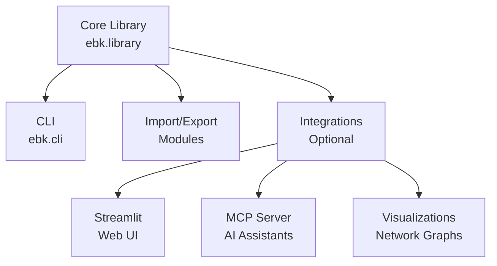

# ebk - eBook Library Manager

Welcome to the ebk documentation! ebk is a powerful eBook metadata management tool with SQLAlchemy + SQLite backend, comprehensive Python API, rich CLI, and AI-powered features.

## Key Features

- 🗄️ **SQLAlchemy + SQLite Backend** - Robust database with full-text search (FTS5)
- 📚 **Fluent Python API** - Comprehensive programmatic interface with method chaining
- 🎨 **Rich CLI** - Beautiful terminal interface powered by Typer and Rich
- 🌐 **Web Server** - FastAPI-based interface for browsing and managing your library
- 🤖 **AI-Powered Enrichment** - Automatic metadata enhancement using LLMs
- 📥 **Multiple Import Sources** - Calibre, raw ebooks, batch imports
- 🔍 **Advanced Search** - Full-text search with FTS5 indexing
- 📤 **Flexible Export** - Hugo sites, ZIP archives, JSON
- 🔧 **Configuration System** - Centralized config at `~/.config/ebk/config.json`
- 🏷️ **Personal Organization** - Tags, ratings, reading status, notes

## Quick Example

```python
from pathlib import Path
from ebk.library_db import Library

# Open library
lib = Library.open(Path("~/ebooks"))

# Fluent query interface
recent_python = (lib.query()
    .filter_by_language("en")
    .filter_by_subject("Python")
    .order_by("publication_date", desc=True)
    .limit(20)
    .all())

# Full-text search
results = lib.search("machine learning algorithms")

# Update reading status
lib.update_reading_status(book_id=42, status="reading", rating=5)

lib.close()
```

## New in Latest Version

### Configuration System

Centralized configuration at `~/.config/ebk/config.json`:

```bash
# Initialize configuration
ebk config init

# Set defaults
ebk config set library.default_path ~/my-ebooks
ebk config set server.port 8000
ebk config set llm.model llama3.2
```

### LLM-Powered Features

Enrich your library metadata using AI:

```bash
# Setup Ollama
ollama pull llama3.2

# Configure ebk
ebk config set llm.provider ollama
ebk config set llm.model llama3.2

# Enrich metadata
ebk enrich ~/library --generate-tags --categorize
```

### Web Server

Browse your library with a modern web interface:

```bash
# Start server
ebk serve ~/library

# Or with auto-open
ebk config set server.auto_open_browser true
ebk serve ~/library
```

## Getting Started

- [Installation](getting-started/installation.md) - Install ebk and optional features
- [Quick Start](getting-started/quickstart.md) - Get up and running in minutes
- [CLI Reference](user-guide/cli.md) - Complete command reference

## Architecture

ebk follows a clean, modular architecture:



## Support

- 🐛 [Report Issues](https://github.com/queelius/ebk/issues)
- 💬 [Discussions](https://github.com/queelius/ebk/discussions)
- 📧 [Contact](mailto:lex@metafunctor.com)